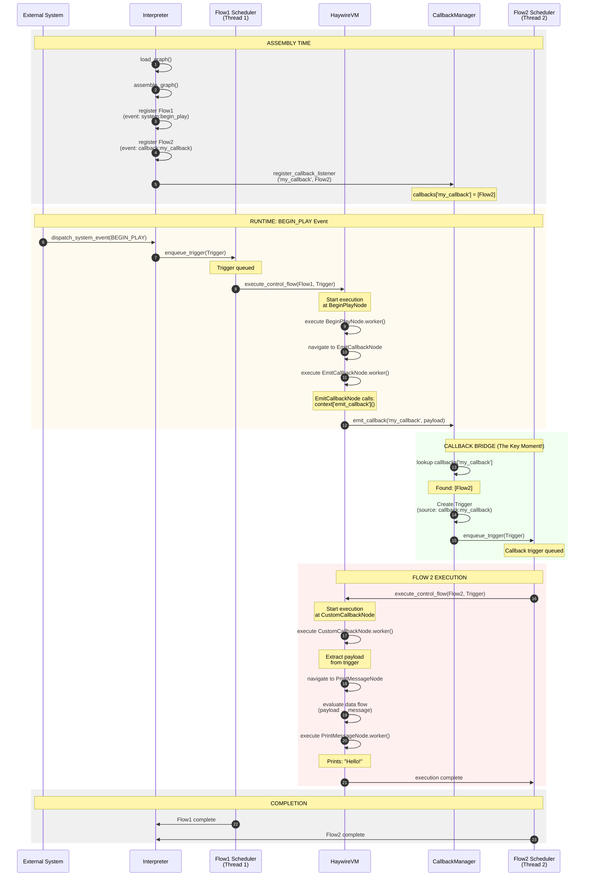
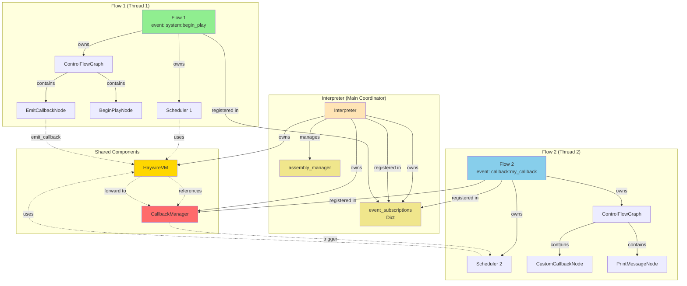

# Callback Flow Diagrams

## Diagram 1: Graph Structure with Nodes and Ports

This shows the two disconnected flows in the graph, with their nodes and relevant ports.

```mermaid
graph TB
    subgraph "Flow 1: Emitter Flow (Event: system:begin_play)"
        BP[BeginPlayNode]
        BP_exec_out["exec (outlet)"]
        BP_timestamp_out["timestamp (outlet)"]
        
        EC[EmitCallbackNode]
        EC_exec_in["exec (inlet)"]
        EC_done_out["done (outlet)"]
        EC_callback_name["callback_name (inlet)<br/>default: 'my_callback'"]
        EC_message["message (inlet)<br/>default: 'Hello!'"]
        
        BP --> BP_exec_out
        BP --> BP_timestamp_out
        BP_exec_out -->|Control Edge| EC_exec_in
        EC_exec_in --> EC
        EC --> EC_done_out
        EC --> EC_callback_name
        EC --> EC_message
    end
    
    subgraph "Flow 2: Listener Flow (Event: callback:my_callback)"
        CC[CustomCallbackNode<br/>EventNode]
        CC_listen_out["listen_callback (outlet)<br/>callback type<br/>event_filter: 'my_callback'"]
        CC_triggered_out["triggered (outlet)"]
        CC_payload_out["payload (outlet)"]
        
        PM[PrintMessageNode]
        PM_exec_in["exec (inlet)"]
        PM_done_out["done (outlet)"]
        PM_message_in["message (inlet)"]
        
        CC --> CC_listen_out
        CC --> CC_triggered_out
        CC --> CC_payload_out
        CC_triggered_out -->|Control Edge| PM_exec_in
        CC_payload_out -->|Data Edge| PM_message_in
        PM_exec_in --> PM
        PM --> PM_done_out
        PM --> PM_message_in
    end
    
    style BP fill:#90EE90
    style CC fill:#90EE90
    style BP_exec_out fill:#FFD700
    style EC_exec_in fill:#FFD700
    style EC_done_out fill:#FFD700
    style CC_triggered_out fill:#FFD700
    style PM_exec_in fill:#FFD700
    style PM_done_out fill:#FFD700
    style CC_listen_out fill:#FF6B6B
    style BP_timestamp_out fill:#87CEEB
    style CC_payload_out fill:#87CEEB
    style PM_message_in fill:#87CEEB
    style EC_callback_name fill:#87CEEB
    style EC_message fill:#87CEEB
    
    classDef eventNode fill:#90EE90,stroke:#333,stroke-width:3px
    classDef controlPort fill:#FFD700,stroke:#333,stroke-width:2px
    classDef dataPort fill:#87CEEB,stroke:#333,stroke-width:2px
    classDef callbackPort fill:#FF6B6B,stroke:#333,stroke-width:2px
```

**Legend:**
- 🟢 Green nodes = Event Nodes
- 🟡 Yellow ports = Control ports (exec)
- 🔵 Blue ports = Data ports
- 🔴 Red port = Callback port (special marker, not a graph connection)

**Note:** There are NO graph edges between Flow 1 and Flow 2. The callback connection happens at runtime through the CallbackManager.

---

## Diagram 2: Runtime Message Flow Between Components

This shows how the callback message flows through the system components at runtime.

**Key Moments in the Flow:**

1-6. **Assembly**: Flows registered, Flow2 registers interest in 'my_callback'
7-11. **Flow1 Starts**: BEGIN_PLAY event triggers Flow1
12-13. **Callback Emission**: EmitCallbackNode calls emit_callback()
14-17. **The Bridge**: CallbackManager looks up listeners and triggers Flow2
18-24. **Flow2 Executes**: CustomCallbackNode receives callback and continues

---

## Diagram 3: Component Relationships (Static Structure)

This shows how components are wired together.

**Component Roles:**

- **Interpreter**: Main coordinator, owns all other components
- **CallbackManager**: THE BRIDGE - shared state connecting flows
- **HaywireVM**: Executes flows, has reference to CallbackManager
- **Flow Schedulers**: Thread + queue per flow
- **Flows**: Independent execution units with their own control graphs

---

## Key Insights from the Diagrams

1. **Graph Structure**: Flows are completely disconnected at the graph level
2. **Assembly Registration**: Flow2 registers interest in 'my_callback' during assembly
3. **Runtime Bridge**: CallbackManager is the shared component that connects flows
4. **Thread Isolation**: Each flow runs in its own thread via its scheduler
5. **Message Path**: EmitCallback → VM → CallbackManager → Flow2 Scheduler → CustomCallback

The callback system enables **decoupled inter-flow communication** without requiring graph edges!